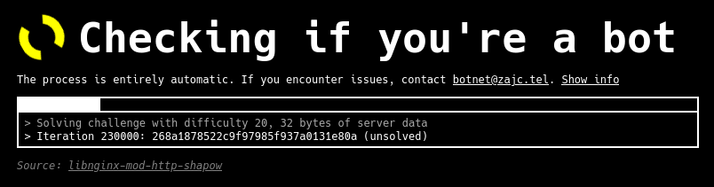

# SHAPOW

Nginx module to keep bots out with a proof-of-work challenge.

SHAPOW presents an automated CAPTCHA page where configured. Real browsers burn some processing power bruteforcing a computational challenge, while bots are dissuaded from proceeding due to costs of performing this in bulk. The difficulty (i.e. approximate amount of CPU time required) can also be configured.

After completing the challenge, visitors are whitelisted by their IP address, optionally also limited by duration and/or visit count.

Cookies are not required to pass the challenge page, but JavaScript is.

## Installation

### Debian
Ready-made packages for Debian stable are available at https://files.zajc.tel/public/builds/shapow. Users of other releases can very easily compile with the instructions below.

1. Install build dependencies

	```bash
	apt install git nginx-dev dpkg-dev
	```

2. Clone the repository

	```bash
	git clone https://git.zajc.tel/libnginx-mod-http-shapow.git && cd libnginx-mod-http-shapow
	```

3. (optional) Adjust build configuration in `src/config.h`.

4. Compile the package

	```bash
	dpkg-buildpackage --no-sign
	```

5. Packages will be created in the parent directory.

### Arch
A PKGBUILD is available on AUR: https://aur.archlinux.org/packages/nginx-mod-shapow. It can be compiled and installed with an AUR helper or manually with makepkg.

### Other
You will need to compile and install the module by hand.

1. Install build dependencies for nginx. SHAPOW does not require anything more than that.
2. Download the source of the nginx binaries you're using. If you're getting nginx from your distribution, make sure you use the same source files (including patches and whatnot), otherwise you will run into issues because nginx has no ABI stability. The official source distribution is at `https://nginx.org/download/nginx-<version>.tar.gz`
3. Clone the module repository from `https://git.zajc.tel/shapow.git` or download and extract the source tarball from `https://files.zajc.tel/public/builds/shapow/<version>/source.tar.xz` and `cd` into it.
4. (optional) Adjust build configuration in `src/config.h`.
5. Build the module binary with
	```bash
	NGINX_PATH=/path/to/nginx/source tools/build.sh
	```
6. The script will tell you where the `ngx_http_shapow_module.so` file was created. Copy it to the nginx modules directory. This is usually `/usr/lib/nginx/modules`, but you should consult the `--modules-path` build flag that your nginx binary was compiled with (`nginx -V` to see all flags) for the exact path.
7. Create the resource root path (`/usr/share/libnginx-mod-http-shapow` by default, but you can change it in `src/config.h`) and copy the files from the `resources/` directory into it.
	```bash
	sudo mkdir -p /usr/share/libnginx-mod-http-shapow && sudo cp resources/* /usr/share/libnginx-mod-http-shapow
	```
8. Create the module config file. `40` is the priority used on Debian, but if you have other modules installed (especially `mod-headers-more-filter`), you should pick a number lower than theirs.
	```bash
	echo "load_module modules/ngx_http_shapow_module.so;" | sudo tee /etc/nginx/modules-available/mod-http-shapow.conf
	```
	```bash
	echo "load_module modules/ngx_http_shapow_module.so;" | sudo tee /etc/nginx/modules-available/mod-http-shapow.conf
	```does
9. Restart nginx.

#### Portability
Most of the module is written using portable calls, but a few lines of code depend `endian.h` and `sys/random.h`, which are nonstandard. For challenge verification, OpenSSL's sha.h is used, which means that nginx has to be compiled against OpenSSL.

If you'd like to use this module on an unsupported platform, let me know, and I'll work something out.

## Usage
### Minimal configuration file
```nginx
shapow_zone_add main 64M 65536; # see Zone size for info

server {
    # ...

    location / {
        shapow on;
        shapow_zone main;
        # fetch expensive resource (with proxy_pass, fastcgi_pass, or similar)
    }
}
```
This configuration shows the challenge page on all requests. When the browser solves it, the user's IP address is whitelisted (see `shapow_whitelist_count`, `shapow_whitelist_duration`, and the Zone size section for expiration criteria), and all further requests are passed through.

SHAPOW returns the challenge response by adding a  `shapow-response` querystring parameter to the URL with a hex-encoded solution. If the solution is not valid, which shouldn't happen under ordinary circumstances, the challenge page is shown again. If the solution is valid, SHAPOW automatically strips this parameter from the request to prevent problems with the proxied service. It will still be included in the access.log, but it won't be passed to `proxy_pass` or present in `$args`.

### Advanced configuration file
```nginx
shapow_zone_add main 64M 65536; # see Zone size for info

map $http_user_agent $shapow_enable { # permit some good bots (beware of User-Agent spoofing!)
    "~CCBot"      n;
    "~Googlebot"  n;
    default       y;
}

server {
    # ...

    shapow_difficulty 10;
    shapow_zone main;

    location / {
        # ... (requests not covered by SHAPOW)
    }
    
    # makes sure SHAPOW's resource files are served where needed, see the Quirks section for more info
    location ~ /shapow_internal/[^/]+$ {
        shapow on;
    }

    location /expensive {
        if ($shapow_enable = y) {
            shapow on;
        }
        shapow_whitelist_count 1000; # user can make 1k requests
        shapow_whitelist_duration 1h; # user stays whitelisted for an hour

        # fetch expensive resource (with proxy_pass, fastcgi_pass, or similar)
    }
    
    # do not cover static resources, since the browser will just fail when trying to load them
    # note that this will also interfere with SHAPOW's own resources, so we need a separate location on /shapow_internal/[^/]+$
    location ~ /expensive/.*\.(jpg|png|js|css)$ {
        # fetch resource
    }
}
```
This configuration only shows the challenge page on paths starting with `/expensive`, but not those ending with `.jpg`, `.png`, `.js`, or `.css`. It will also not show the challenge page if the User-Agent header contains `CCBot` or `Googlebot`. The difficulty is a little lower than the default, and whitelists are valid for 1000 requests or one hour, whichever happens first.

### `shapow`
Syntax: **`shapow`**` on | off`  
Default: `shapow off`  
Context: http, server, location, if

Enables or disables SHAPOW. If enabled,
- requests to paths ending with `/shapow_internal/challenge.css`, `/shapow_internal/challenge.js`, `/shapow_internal/challenge-worker.js` will be served their respective resource files
- requests to paths ending with `/shapow_internal/challenge-settings.js` will be served the challenge settings generated from the difficulty, client address, current time, and random data stored in the used SHAPOW zone.
- requests to all other paths will be:
	- (if the address isn't in the whitelist yet) served the challenge HTML page
	- (otherwise) passed through
	
If disabled, all requests are passed through, including those to resource file or setting paths.

### `shapow_zone`
Syntax: **`shapow_zone`***` key`*  
Default: -  
Context: http, server, location, if

Sets the shared memory zone to be used, identified by `key`. This directive is mandatory if `shapow on` is set, and the zone must be created in the http context with `shapow_zone_add`.

### `shapow_difficulty`
Syntax: **`shapow_difficulty`***` number`*  
Default: `shapow_difficulty 12`
Context: http, server, location, if

Sets the challenge difficulty to be used, expressed as the *`number`* of leading bits that must be zero. Higher values means more computation required to solve the challenge, which in turn potentially means more bots deterred, but also longer wait times for users. Values in the 10-14 range are recommended, and you are encouraged to run the challenge a few times (especially on low-end or underpowered devices such as smartphones and laptops!) to see how it affects the wait time.

Keep in mind that while the default challenge page provides a progress bar based on the iteration count, the challenge works more like a lottery; wait times tend to average out on some number, but they will have outliers.

### `shapow_whitelist_count`
Syntax: **`shapow_whitelist_count`***` number`*  
Default: `shapow_whitelist_count 0`
Context: http, server, location, if

Sets the whitelist usage count limit. When an address is whitelisted, it is allowed to make *`number`* requests to the location with this directive before having to solve the challenge again. If two locations share the same `shapow_zone` use a different `shapow_whitelist_count`, whitelist can remain valid for one location but not the other.

### `shapow_whitelist_duration`
Syntax: **`shapow_whitelist_duration`***` path`*  
Default: `shapow_whitelist_count /usr/share/libnginx-mod-http-shapow/challenge.html`
Context: http, server, location, if

Sets the challenge HTML file served to non-whitelisted addresses. The file is read from *`path`* on module load and stored in memory until reload. *`path`* is not relative to `root` or `alias` and should be absolute. whitelist duration.

### `shapow_challenge_html_path`
Syntax: **`shapow_challenge_html_path`***` path`*  
Default: `shapow_challenge_html_path /usr/share/libnginx-mod-http-shapow/challenge.html`
Context: http, server, location, if

Sets the challenge HTML file served to non-whitelisted addresses. The file is read from *`path`* on module load and kept in memory until reload or restart. *`path`* is not relative to `root` or `alias` and should be absolute.

For requests that return the challenge page, the `Content-Security-Policy` is set to the following value:
```
default-src 'self'; script-src 'self' 'unsafe-inline' 'unsafe-hashes' 'sha256-n5/yu3Prbxz0iuaChj1dnMv0BD7zul2ThC5fOj9FuTo='
```

Note that the `unsafe-inline` directive is ignored by browsers that support `unsafe-hashes`. `sha256-n5/yu3Prbxz0iuaChj1dnMv0BD7zul2ThC5fOj9FuTo=` corresponds to the following script (kept on one line to make sure formatting doesn't change the hash):
```
<script>(function(){base=document.createElement("base"); base.href=location.pathname+"/"; document.head.prepend(base)})()</script>
```

[Browsers tend to handle relative paths unintuitively](https://stackoverflow.com/q/31111257), including those to load resources, and this inline script works around that behaviour. If you wish to use it in a custom challenge HTML file, you have to copy it verbatim to prevent changes to the hash. Other scripts and resources can't be included inline without recompiling the module with a different CSP header.

### `shapow_challenge_css_path`
Syntax: **`shapow_challenge_css_path`***` path`*` | ''`  
Default: `shapow_challenge_css_path /usr/share/libnginx-mod-http-shapow/challenge.css`
Context: http, server, location, if

Sets the challenge CSS file served to all requests for paths ending with `/shapow_internal/challenge.css`. The file is read from *`path`* at module load and kept in memory until reload or restart. *`path`* is not relative to `root` or `alias` and should be absolute.

If *`path`* is an empty string (`shapow_challenge_css_path '';`), no file will be loaded and requests to `/shapow_internal/challenge.css` will not be treated specially.

### `shapow_challenge_js_path`
Syntax: **`shapow_challenge_js_path`***` path`*` | ''`  
Default: `shapow_challenge_js_path /usr/share/libnginx-mod-http-shapow/challenge.js`
Context: http, server, location, if

Sets the challenge script file served to all requests for paths ending with `/shapow_internal/challenge.js`. The file is read from *`path`* at module load and kept in memory until reload or restart. *`path`* is not relative to `root` or `alias` and should be absolute.

If *`path`* is an empty string (`shapow_challenge_js_path '';`), no file will be loaded and requests to `/shapow_internal/challenge.js` will not be treated specially.

### `shapow_challenge_worker_path`
Syntax: **`shapow_challenge_worker_path`***` path`*` | ''`  
Default: `shapow_challenge_worker_path /usr/share/libnginx-mod-http-shapow/challenge-worker.js`
Context: http, server, location, if

Sets the challenge worker script file served to all requests for paths ending with `/shapow_internal/challenge-worker.js`. The file is read from *`path`* at module load and kept in memory until reload or restart. *`path`* is not relative to `root` or `alias` and should be absolute.

If *`path`* is an empty string (`shapow_challenge_worker_path '';`), no file will be loaded and requests to `/shapow_internal/challenge-worker.js` will not be treated specially.

### `shapow_zone_add`
Syntax: **`shapow_zone_add`***` key size number`*  
Default: -  
Context: http

Creates a shared memory zone for `shapow_zone`. The zone stores the table of whitelisted addresses, as well as some other shared data. One zone can be used by multiple `shapow_zone` directives.
- *`key`* sets the zone's key, and should not be empty
- *`size`* sets size, see the Zone size section for guidance
- *`number`* sets the number of hash buckets, see the Zone size section for guidance

## Zone size
The shared memory zone keeps both the hashtable (the size of which is determined by the bucket count) and whitelist entries.

SHAPOW uses separate chaining and a fixed bucket count. This means that higher bucket counts improve lookup time (and by extension latency) when there are lots of whitelist entries, but consume more memory. Using 65536 buckets, which takes about 1MiB in the shared zone, seems like a good starting value.

The size of the whitelist entries varies by protocol (IPv4 addresses are smaller than IPv6 ones). You can fit roughly 32k IPv4 addresses or 16k IPv6 addresses in 1MiB of memory.

This means that **a 64MiB zone with 65536 buckets can store about 2 million IPv4 entries, or 1 million IPv6 entries** (or any mix of the two).

When the zone runs out of memory, the oldest half of whitelists are removed. Requests coming from removed addresses will be shown a challenge page again, even if you haven't set `shapow_whitelist_duration` or a `shapow_whitelist_count`.

You can also improve memory efficiency by disabling the `shapow_whitelist_count` and/or `shapow_whitelist_duration` directives in `src/config.h` and recompiling the module. Disabling either will halve space occupied by IPv6 entries, and disabling both will halve the space occupied by IPv4 entries. Disabling both does not further reduce space used by IPv4 entries because nginx' memory allocator rounds sizes up to the nearest power of two.

## Quirks
- Due to how nginx handles request phases, the module might not trigger at all for certain directives (so far I've only seen this happen with `return`). Moving the handler to the rewrite phase (`NGX_HTTP_REWRITE_PHASE`) fixes this behaviour, but means directives can't be used in if statements, again due to how phases work.
- SHAPOW's HTML uses relative paths to load resources, but with advanced or very specific `location` setups this might not work as expected. To work around this, you can create a catch-all location just for `/shapow_internal/`:
	```nginx
	server {
	    shapow_zone main; # this affects challenge resources, so for this workaround it should be the same for all locations
	    shapow_difficulty 10; # ditto (or don't set it at all and use the default)
	    # same for shapow_challenge_html_path, shapow_challenge_css_path, shapow_challenge_js_path, and shapow_challenge_worker_path

	    # this location block doesn't cover subdirectories of /exact, so /exact/shapow_internal/* would 404!
	    location = /exact {
	        shapow on;
	        # shapow_whitelist_count and shapow_whitelist_duration are fine to set per-location
	        ...
	    }

	    # this will cover /shapow_internal/ files everywhere
	    location ~ /shapow_internal/[^/]+$ {
	        shapow on;
	    }
	}
	```
	If you use a custom HTML file, you can also load resources from an absolute path and avoid this altogether, but make sure they're on the same [origin](https://developer.mozilla.org/en-US/docs/Glossary/Origin) to comply with the Content-Security-Policy rules!
- The request address is used directly, meaning this module won't work for servers behind reverse proxies, because nginx sees a different client address. Supporting different means of distinguishing users (such as from a variable like `$proxy_add_x_forwarded_for`) is currently not supported and would be difficult to implement efficiently. Let me know if you need this functionality, and I'll try to work something out. Patches are also welcome :).

## See also
- https://github.com/simon987/ngx_http_js_challenge_module
	+ Similar idea to SHAPOW, but depends on cookies instead of a whitelist, and rolls its own crypto.
- https://anubis.techaro.lol/
	+ Much more actively developed, but also depends on cookies and runs as a separate daemon.